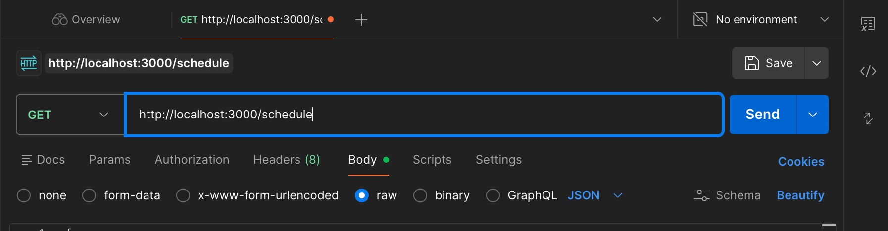
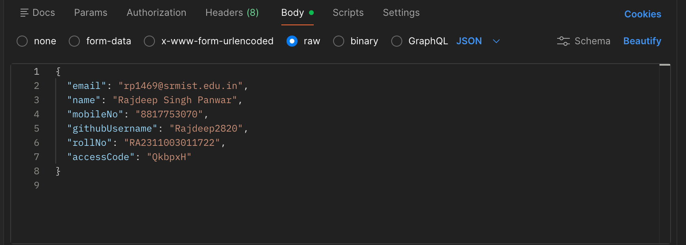
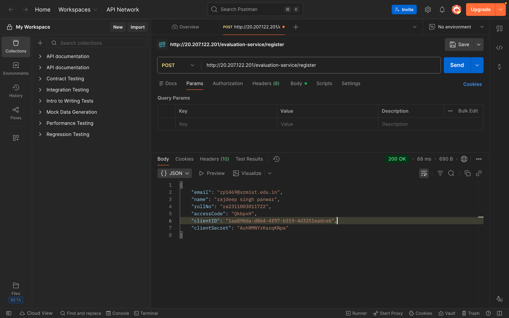
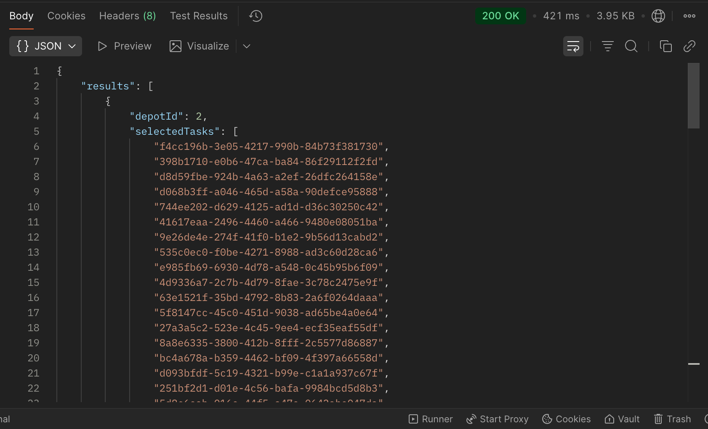
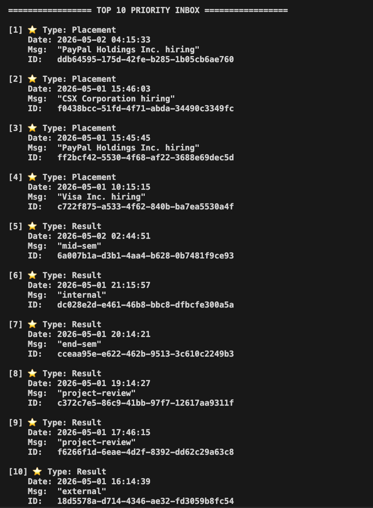

# Backend Architecture Assessment Monorepo

This repository contains the backend assessment implementations for both the **Vehicle Maintenance Scheduler** and the **Campus Notifications** microservices. The services share a decoupled, centralized logging middleware architecture.

---

## 🛠 Project 1: Vehicle Maintenance Scheduler

A microservice built to optimally schedule vehicle maintenance tasks across multiple repair depots. It acts as an integration layer between the Evaluation Service APIs and a custom **0/1 Knapsack Dynamic Programming (DP)** engine designed to maximize the maintenance impact strictly within available mechanic hour limits.

### 🚀 Setup & Execution

1. **Install dependencies:**
   ```bash
   npm install
   ```

2. **Configure your `.env`:**
   Populate your `.env` file with the client credentials retrieved from the registration API:
   ```env
   EVALUATION_SERVICE_URL=http://20.207.122.201
   USER_EMAIL=youremail@abc.edu
   ...
   CLIENT_ID=YOUR_CLIENT_ID
   CLIENT_SECRET=YOUR_CLIENT_SECRET
   PORT=3000
   ```

3. **Start the server:**
   ```bash
   node vehicle_maintenance_scheduler/server.js
   ```
   *The server will securely execute the multi-step handshake with the `/auth` endpoint automatically on boot.*

4. **Run the Scheduler:**
   Send a `GET` request to `http://localhost:3000/schedule` to stream external data through the algorithm.

### 🏗 System Architecture

- **Logging Middleware:** An isolated, extensible module that dynamically injects JSON Web Tokens. It asynchronously dispatches application events and handles network drops securely.
- **Evaluation Service Manager:** Centralizes the authentication handshake, securely isolating token usage in memory.
- **The DP Optimization Engine:** The evaluation endpoints returned non-standard payload structures. The app maps them into a global task pool and evaluates them against depot capacities in `O(N*W)` time. It guarantees absolute maximum mechanical impact without exceeding capacity constraints.

### 📸 Validation Screenshots

**1. API Request Configurations**

*Client configuration for triggering generation*


*Profile payload successfully authenticated*


*Profile payload successfully authenticated*

**2. Final Dynamic Programming Algorithmic Results**

*Final O(N*W) mathematical output mapped cleanly to Postman interface*

---

## 🎓 Project 2: Campus Notifications System

A system design and algorithm module architecting a scalable real-time notification engine for 50,000+ campus students, executing asynchronous message queue strategies and sorting mechanics.

### 📝 Stage 1-5 Requirements
All database scaling diagrams, PostgreSQL composite query optimizations (fixing Table Scan `O(N)` bottlenecks), and the refactoring of blocking notification loops into async event-driven push architectures are meticulously documented inside `notification_system_design.md`.

### ⚡ Stage 6: Priority Inbox Implementation
The codebase includes an actual mathematical priority sorting algorithm interacting safely with the live evaluation servers. It securely authenticates, downloads the unread array list, and dynamically maps B-Tree style constraints sorting by mathematical category weight (`Placement > Result > Event`) plus timestamp recency. 

**To test the Priority Inbox execution:**
```bash
node notification_app_be/index.js
```
*The script will print the computationally determined Top 10 Priority Array directly to the terminal!*


